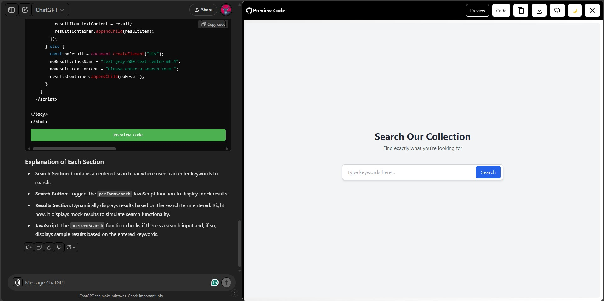

# ChatGPT Code Preview Extension

## Overview

The ChatGPT Code Preview Extension is a browser extension designed to enhance the coding experience on ChatGPT. It allows users to preview and interact with code snippets directly within the ChatGPT interface.

## Features

1. **Live Code Preview**: Instantly see the output of HTML, CSS, and JavaScript code.
2. **Syntax Highlighting**: View code with proper syntax highlighting for better readability.
3. **Copy Code**: Easily copy the entire code snippet to your clipboard.
4. **Download Code**: Download the code snippet as a file with the appropriate extension.
5. **Resizable Preview**: Adjust the size of the preview panel to your liking.

## Installation

1. Download the latest release from the GitHub release page.
2. Extract the files to a folder.
3. For Chrome go to `chrome://extensions/` in your browser. 
   For Edge go to `edge://extensions/` in your browser. 
4. Enable Developer mode (top right).
5. Click Load unpacked and select the extracted folder.
6. Activate the extension.

## Usage

1. Visit ChatGPT (https://chatgpt.com/).
2. When you see a code snippet, a "Preview" button will appear next to it.
3. Click the "Preview" button to open the preview panel.
4. Use the "Preview" and "Code" tabs to switch between the output and the source code.
5. Use the "Copy Code" and "Download Code" buttons as needed.

## Contribution

Feel free to contribute to this project by submitting pull requests or reporting issues on the project's GitHub repository.

## License

This project is licensed under the MIT License.

